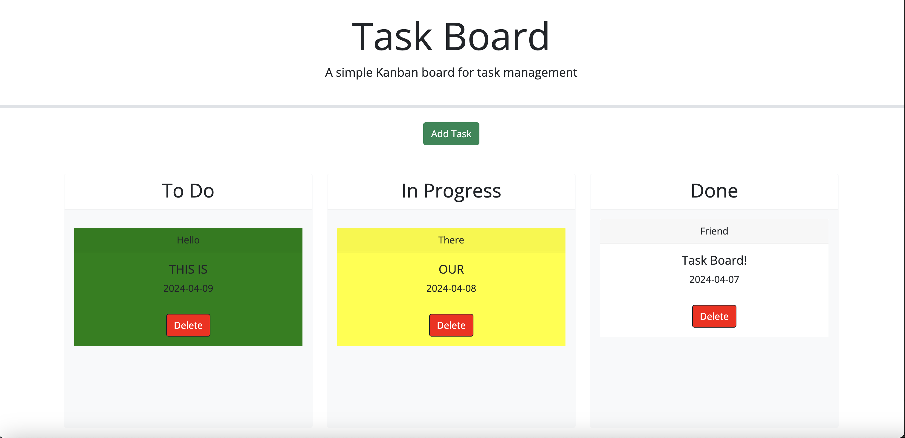

# Challenge5
A repo for my week 5 challenge at Vanderbilt University. The purpose of this repo to is introduce me to the usage of third party API's. 

## Table of Contents 

N/A

## Usage 

In this repo, we were given starter HTMl code and had to make the javscript code in order to render, move, drop, and  delete task cards. 

Please try for yourself:
https://aakabia.github.io/Challenge5/

## Credits:

N/A

## License 
MIT Licsense 

